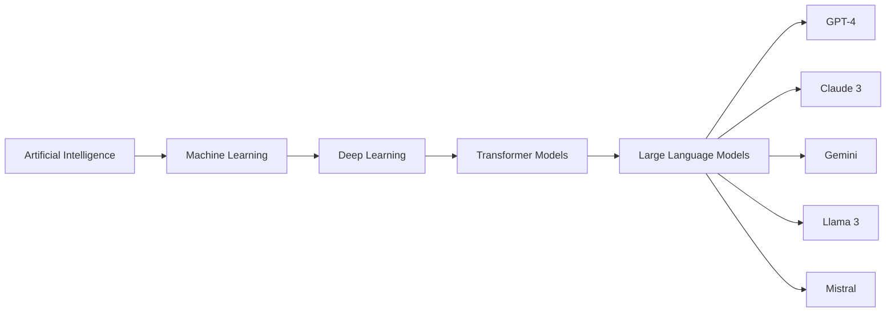

# 2. Evolution of AI → ML → DL → LLM

AI has evolved through several major stages.

---

## Evolution Overview

| Technology              | Description                             | Example          |
| ----------------------- | --------------------------------------- | ---------------- |
| Artificial Intelligence | Systems exhibiting intelligent behavior | Chess Programs   |
| Machine Learning        | Learning patterns from data             | Spam Detection   |
| Deep Learning           | Multi-layer neural networks             | Face Recognition |
| Large Language Models   | Language understanding and generation   | ChatGPT          |

---

## Artificial Intelligence

AI refers to machines that can mimic human intelligence.

Examples:

* Expert Systems
* Chess Programs
* Rule-based Systems

---

## Machine Learning

Machine Learning is a subset of AI where systems learn from data rather than explicit programming.

### Types of Machine Learning

| Type                   | Description                         |
| ---------------------- | ----------------------------------- |
| Supervised Learning    | Learn from labeled data             |
| Unsupervised Learning  | Discover hidden patterns            |
| Reinforcement Learning | Learn through rewards and penalties |

Examples:

* Email Spam Detection
* Customer Segmentation
* Recommendation Systems

---

## Deep Learning

Deep Learning uses neural networks with multiple hidden layers.

Advantages:

* Automatic feature extraction
* High accuracy
* Handles complex data

Applications:

* Image Classification
* Speech Recognition
* Language Translation

---

## Large Language Models (LLMs)

LLMs are deep learning models trained on massive text datasets.

Examples:

* ChatGPT
* Claude
* Gemini
* Llama
* Mistral

Capabilities:

* Text generation
* Question answering
* Translation
* Summarization
* Code generation

---

[Next Topic: Major Application Domains of AI](./03-major-application-domains.md)
