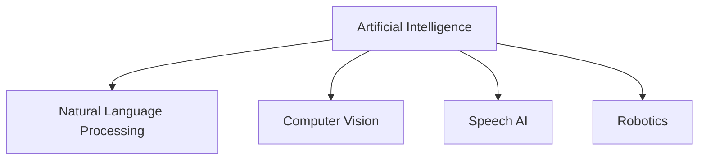

# 3. Major Application Domains of AI

---

## 3.1 Natural Language Processing (NLP)

NLP enables computers to understand and generate human language.

Applications:

* Chatbots
* Machine Translation
* Sentiment Analysis
* Text Summarization

Examples:

* ChatGPT
* Google Translate

---

## 3.2 Computer Vision

Computer Vision enables machines to understand images and videos.

Applications:

* Face Recognition
* Object Detection
* Medical Imaging
* Autonomous Vehicles

Examples:

* Facial Unlock
* Traffic Monitoring

---

## 3.3 Speech Processing

Speech AI allows machines to understand spoken language.

Applications:

* Speech Recognition
* Voice Assistants
* Text-to-Speech Systems

Examples:

* Siri
* Alexa
* Google Assistant

---

## 3.4 Robotics

Robotics combines AI with mechanical systems.

Applications:

* Industrial Automation
* Warehouse Robots
* Medical Robots
* Self-Driving Cars

---

## Application Domain Summary

| Domain          | Purpose                | Example           |
| --------------- | ---------------------- | ----------------- |
| NLP             | Language Understanding | ChatGPT           |
| Computer Vision | Image Analysis         | Face Recognition  |
| Speech AI       | Voice Processing       | Alexa             |
| Robotics        | Intelligent Machines   | Self-driving Cars |

---

[Next Topic: Deep Learning Fundamentals](./04-deep-learning-fundamentals.md)
