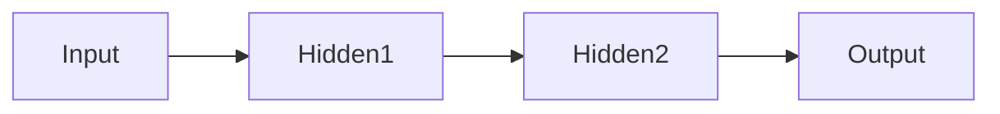

# 4. Deep Learning Fundamentals

Deep Learning is based on Artificial Neural Networks.

## Neural Network Components

| Component     | Function            |
| ------------- | ------------------- |
| Input Layer   | Receives data       |
| Hidden Layers | Learn patterns      |
| Output Layer  | Produces prediction |

---

[Next Topic: Transformer Architecture](./05-transformer-architecture.md)
