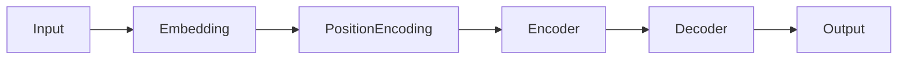

# 5. Transformer Architecture

Transformers revolutionized Natural Language Processing in 2017 through the paper:

**Attention Is All You Need**

---

## Why Transformers?

Older models such as RNNs and LSTMs:

* Process sequentially
* Difficult to parallelize
* Struggle with long context

Transformers:

* Process all words simultaneously
* Handle long-range dependencies
* Scale efficiently

---

## Transformer Architecture

---

## Main Components

| Component           | Purpose                  |
| ------------------- | ------------------------ |
| Embedding           | Convert words to vectors |
| Positional Encoding | Preserve word order      |
| Encoder             | Understand input         |
| Decoder             | Generate output          |
| Attention           | Focus on important words |

---

[Next Topic: Attention Mechanism](./06-attention-mechanism.md)
