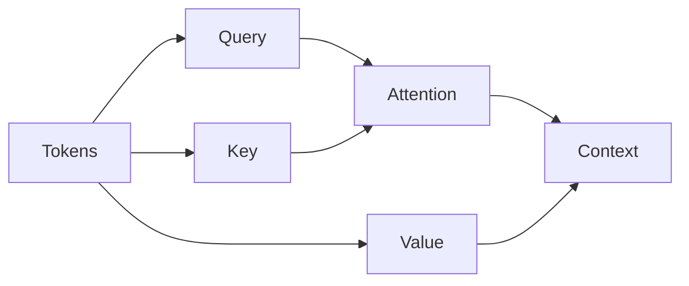

# 6. Attention Mechanism

Attention is the key innovation behind Transformers.

It allows the model to focus on important words in a sentence.

Example:

"The cat sat on the mat because it was tired."

The model learns that "it" refers to "cat".

---

## Attention Flow

---

## Self-Attention

Self-attention allows each word to examine every other word in the sentence.

Benefits:

* Better context understanding
* Long-range dependency capture
* Parallel processing

---

[Next Topic: Major Large Language Models](./07-major-large-language-models.md)
