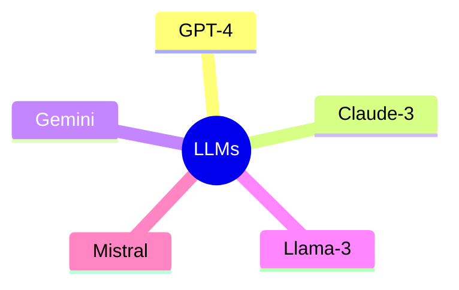

# 7. Major Large Language Models

Several organizations have developed powerful LLMs.

| Model    | Organization | Key Strength      |
| -------- | ------------ | ----------------- |
| GPT-4    | OpenAI       | Reasoning, Coding |
| Claude 3 | Anthropic    | Long Context      |
| Gemini   | Google       | Multimodal AI     |
| Llama 3  | Meta         | Open Models       |
| Mistral  | Mistral AI   | Efficiency        |

---

## LLM Landscape

---

## Common Features

* Text Generation
* Summarization
* Translation
* Question Answering
* Code Generation
* Content Creation

---

[Next Topic: Generative vs Discriminative Models](./08-generative-vs-discriminative-models.md)
