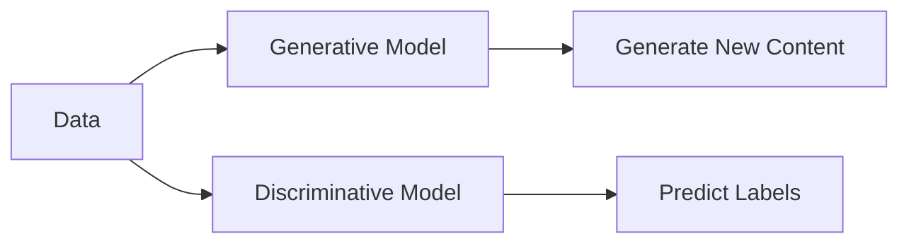

# 8. Generative vs Discriminative Models

Machine learning models can be broadly categorized into two groups.

---

## Generative Models

Learn how data is generated.

Can create new data.

Examples:

* GPT
* GAN
* VAE
* Diffusion Models

---

## Discriminative Models

Learn boundaries between classes.

Used for prediction and classification.

Examples:

* Logistic Regression
* SVM
* Decision Trees

---

## Comparison

| Feature           | Generative Models | Discriminative Models    |
| ----------------- | ----------------- | ------------------------ |
| Learn             | Data Distribution | Class Boundaries         |
| Generate New Data | Yes               | No                       |
| Classification    | Possible          | Primary Goal             |
| Examples          | GPT, GAN, VAE     | SVM, Logistic Regression |

---

---

[Next Topic: Evolution of Generative AI](./09-evolution-of-generative-ai.md)
