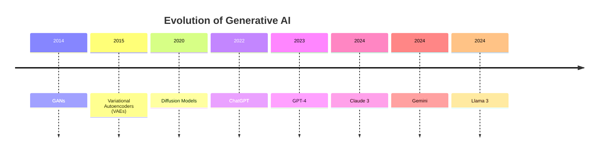

# 9. Evolution of Generative AI

Generative AI has progressed significantly over the last decade.

---

## GANs (Generative Adversarial Networks)

Introduced by Ian Goodfellow in 2014.

Components:

* Generator
* Discriminator

Applications:

* Image Generation
* Deepfakes
* Data Augmentation

---

## Variational Autoencoders (VAEs)

VAEs learn compressed representations of data.

Applications:

* Image Generation
* Anomaly Detection
* Recommendation Systems

---

## Diffusion Models

Generate data by gradually removing noise.

Examples:

* Stable Diffusion
* DALL·E

Advantages:

* High quality image generation
* Stable training

---

## Large Language Models

Latest generation of generative AI.

Capabilities:

* Language Generation
* Reasoning
* Coding
* Agentic Workflows

---

[Next Topic: Evaluation of Large Language Models](./10-evaluation-of-llms.md)
