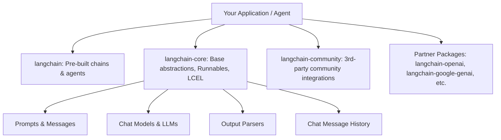
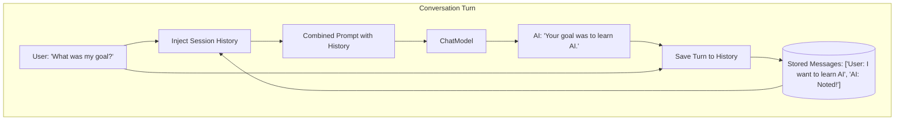
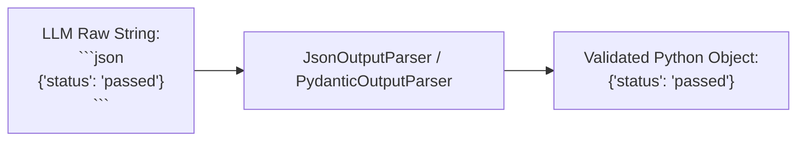

# 3.1 LangChain Framework: Chains, Memory, Output Parsers

---

## 1. Introduction: Why Do We Need an LLM Framework?

In Units 1 and 2, we directly used vendor SDKs (e.g., `openai`, `google-generativeai`, `anthropic`) to send prompts and receive completions. While direct API calls work for simple, one-off prompts, building real-world enterprise applications quickly introduces complex challenges:

1. **Vendor Lock-in**: Switching from OpenAI to Google Gemini or an open-source local model (like Llama 3 via Ollama) requires rewriting request payloads, response parsers, and client configurations.
2. **Brittle Prompt Management**: Hardcoded Python f-strings become difficult to maintain, share, version-control, and validate across multi-step workflows.
3. **Stateless APIs vs. Conversational Continuity**: LLM APIs have zero built-in memory; managing multi-turn dialogue state across multiple users requires external storage and prompt injection.
4. **Unstructured Output vs. Rigid Application Logic**: Models return natural language text. When software downstream requires strict JSON objects, database rows, or Pydantic data models, raw text parsing frequently breaks due to subtle formatting variations.
5. **Multi-Step Coordination (Pipelines)**: Real workflows require chaining operations: fetching documents, summarizing, extracting key entities, formatting, and saving to a database.

**LangChain** is an open-source orchestration framework designed specifically to simplify building data-aware, agentic, and stateful applications powered by Large Language Models.

---

## 2. The LangChain Architecture & Ecosystem

Modern LangChain is structured into clean, modular packages:



### Core Packages:
* **`langchain-core`**: The foundational library containing the core abstractions (`Runnable`, `BasePromptTemplate`, `BaseChatModel`, `BaseOutputParser`, `InMemoryChatMessageHistory`). It has minimal dependencies and provides the bedrock of the LangChain Expression Language (LCEL).
* **`langchain`**: Higher-level cognitive architecture components, chains, memory wrappers, and agent systems.
* **`langchain-community`**: Community-maintained third-party integrations (e.g., Chroma, FAISS, Elasticsearch, HuggingFace).
* **Partner Packages** (`langchain-openai`, `langchain-google-genai`, `langchain-anthropic`, `langchain-ollama`): Dedicated, vendor-optimized packages maintained directly for each major LLM ecosystem.

---

## 3. Core Concept 1: Chains and LangChain Expression Language (LCEL)

### 3.1 What is a Chain?
A **Chain** represents a sequence of automated calls. In its simplest form, a chain links three fundamental building blocks:

$$\text{User Input} \longrightarrow \text{Prompt Template} \longrightarrow \text{Language Model} \longrightarrow \text{Output Parser} \longrightarrow \text{Structured Result}$$


### 3.2 What is LCEL (LangChain Expression Language)?
LCEL is a declarative syntax for composing components into production-ready chains using the Unix-style **pipe operator (`|`)**. 

Every LCEL component implements the **`Runnable` interface**, which guarantees uniform execution methods:
* `.invoke(input)`: Run the chain synchronously on a single input.
* `.ainvoke(input)`: Run the chain asynchronously.
* `.batch([input1, input2])`: Process a batch of inputs concurrently.
* `.stream(input)`: Stream response tokens back chunk-by-chunk in real time.

### 3.3 Basic LCEL Chain Code Snippet

```python
from langchain_core.prompts import ChatPromptTemplate
from langchain_core.output_parsers import StrOutputParser
# Replace with ChatOpenAI(model="gpt-4o") or ChatGoogleGenerativeAI(model="gemini-1.5-flash")
from langchain_core.language_models.fake import FakeListChatModel

# 1. Define Prompt Template
prompt = ChatPromptTemplate.from_messages([
    ("system", "You are an expert AI tutor. Explain topics in one concise sentence."),
    ("human", "Explain {topic}.")
])

# 2. Define Model
model = FakeListChatModel(responses=["LangChain is an orchestration framework for LLMs."])

# 3. Define Parser
parser = StrOutputParser()

# 4. Compose with LCEL pipe operator (|)
chain = prompt | model | parser

# 5. Execute
result = chain.invoke({"topic": "LangChain"})
print("Output:", result)
```

### 3.4 Multi-Step Pipelines with `RunnablePassthrough`
In multi-step chains, intermediate outputs often need to be passed alongside original inputs. LCEL uses Python dictionaries and `RunnablePassthrough` to route data:

```python
from langchain_core.runnables import RunnablePassthrough

# A two-stage pipeline: generate explanation, then critique it
explainer_prompt = ChatPromptTemplate.from_template("Explain {topic} in 10 words.")
reviewer_prompt = ChatPromptTemplate.from_template("Grade this explanation: '{explanation}'. Give a 1-sentence verdict.")

explainer_chain = explainer_prompt | model | StrOutputParser()

# Compose full multi-step pipeline
full_chain = (
    {"explanation": explainer_chain, "topic": RunnablePassthrough()}
    | reviewer_prompt
    | model
    | StrOutputParser()
)
```

---

## 4. Core Concept 2: Conversational Memory

### 4.1 The Statelessness Problem
Large Language Models are completely **stateless**. Every API call is independent:
* Turn 1: User says *"My name is Hasmukh."* $\rightarrow$ Model replies *"Hello Hasmukh!"*
* Turn 2: User says *"What is my name?"* $\rightarrow$ The model has no recollection unless Turn 1 is explicitly provided inside the new prompt payload.

### 4.2 Memory Architectures
LangChain provides several strategies for maintaining conversation state:

| Memory Strategy | How it Works | Pros | Cons |
| :--- | :--- | :--- | :--- |
| **Buffer Memory** | Appends every user and AI message verbatim to the prompt. | Perfect accuracy; complete context retention. | Prompt tokens grow linearly with dialogue length; eventually exhausts context window. |
| **Window Buffer Memory** | Keeps only the last $K$ interactions (e.g., last 3 turns). | Predictable token usage; avoids context overflow. | Forgets older conversation facts outside the $K$ turn window. |
| **Summary Memory** | Uses a background LLM call to progressively summarize past conversation history. | Retains high-level facts indefinitely in compact token footprint. | Incurs additional API latency and token cost for summarization; may lose fine details. |
| **Vector Store Memory** | Stores past messages in a vector database and retrieves only semantically relevant past messages. | Scalable to infinite historical context; selectively retrieves facts. | Higher architectural complexity and vector retrieval latency. |



### 4.3 Modern LCEL Memory: `RunnableWithMessageHistory`
In modern LangChain (v0.2+ and v0.3+), memory is decoupled from the chain logic. You construct a standard chain with a `MessagesPlaceholder`, and wrap it with `RunnableWithMessageHistory`:

```python
from langchain_core.prompts import ChatPromptTemplate, MessagesPlaceholder
from langchain_core.chat_history import InMemoryChatMessageHistory
from langchain_core.runnables.history import RunnableWithMessageHistory
from langchain_core.output_parsers import StrOutputParser

# 1. Prompt with a MessagesPlaceholder for dynamic history injection
prompt = ChatPromptTemplate.from_messages([
    ("system", "You are a helpful study assistant."),
    MessagesPlaceholder(variable_name="history"),
    ("human", "{input}")
])

chain = prompt | model | StrOutputParser()

# 2. Session store mapping session_id -> InMemoryChatMessageHistory
session_store = {}

def get_session_history(session_id: str):
    if session_id not in session_store:
        session_store[session_id] = InMemoryChatMessageHistory()
    return session_store[session_id]

# 3. Wrap chain with history manager
chat_with_history = RunnableWithMessageHistory(
    chain,
    get_session_history,
    input_messages_key="input",
    history_messages_key="history"
)

# 4. Multi-turn execution scoped by session_id
config = {"configurable": {"session_id": "student_101"}}

res1 = chat_with_history.invoke({"input": "I am studying PGDCA Unit 3."}, config=config)
res2 = chat_with_history.invoke({"input": "Which unit am I studying?"}, config=config)
```

---

## 5. Core Concept 3: Output Parsers & Structured Generation

### 5.1 The Need for Output Parsers
When an LLM response is consumed by human readers, free-form prose is acceptable. However, software systems require predictable schemas:
* Valid JSON for frontend UI components.
* Strict integers, floats, or booleans for database records.
* Validated Pydantic models for type-safe backend services.

An **Output Parser** takes the raw string or `AIMessage` from the model, strips formatting anomalies (e.g., markdown triple-backticks ```` ```json ````), extracts the data, and transforms it into the desired Python data structure.



### 5.2 Key LangChain Parsers

1. **`StrOutputParser`**: Simplest parser. Extracts the text content directly from an `AIMessage` and strips extraneous whitespace.
2. **`JsonOutputParser`**: Parses LLM output into a standard Python `dict` or `list`. It can optionally take a Pydantic schema to generate instructions.
3. **`PydanticOutputParser`**: The most rigorous parser. It takes a custom Pydantic schema (`BaseModel`), automatically generates formatting instructions, and validates the model's output fields and types upon return.

### 5.3 Pydantic Output Parser Code Snippet

```python
from pydantic import BaseModel, Field
from langchain_core.output_parsers import PydanticOutputParser
from langchain_core.prompts import PromptTemplate

# 1. Define the desired schema using Pydantic
class StudentReport(BaseModel):
    student_name: str = Field(description="Full name of the student")
    course: str = Field(description="Enrolled program or course")
    grade: str = Field(description="Letter grade: A, B, C, D, or F")
    passed: bool = Field(description="True if student passed, False otherwise")

# 2. Instantiate parser
parser = PydanticOutputParser(pydantic_object=StudentReport)

# 3. Create prompt template with parser format instructions
prompt = PromptTemplate(
    template="Extract student record from the text.\n{format_instructions}\nText: {input}\n",
    input_variables=["input"],
    partial_variables={"format_instructions": parser.get_format_instructions()}
)

# 4. Chain: prompt -> model -> parser
structured_chain = prompt | model | parser
```

### 5.4 How Format Instructions Work Under the Hood
Calling `parser.get_format_instructions()` injects a deterministic instruction directly into the prompt prompt, explaining the exact JSON schema and instructing the model:
> *"The output should be formatted as a JSON instance that conforms to the JSON schema below... Return ONLY raw JSON without markdown markers."*

If the model produces invalid fields, Pydantic raises a `ValidationError`, allowing applications to implement retry decorators or `OutputFixingParser` fallback logic.

---

## 6. Summary Comparison: Framework vs. Raw API

| Aspect | Raw API (Unit 1 & 2) | LangChain Framework (Unit 3) |
| :--- | :--- | :--- |
| **Model Portability** | Vendor-specific SDK methods (`openai.chat.completions`, `genai.generate_content`). | Standard `BaseChatModel` interface (`ChatOpenAI`, `ChatGoogleGenerativeAI`, `ChatOllama`). |
| **Pipelining** | Manual function nesting and procedural data manipulation. | Declarative LCEL pipe syntax (`prompt \| model \| parser`). |
| **Memory** | Manual list manipulation (`messages.append(...)`) across each loop. | Automated state management (`RunnableWithMessageHistory`, `InMemoryChatMessageHistory`). |
| **Output Extraction**| Fragile regex parsing or manual `json.loads()` with custom validation. | Type-safe parsers (`StrOutputParser`, `JsonOutputParser`, `PydanticOutputParser`). |
| **Streaming & Batching**| Custom async generators and loops. | Built-in uniform `.stream()`, `.batch()`, and `.ainvoke()` across all runnables. |

---

## 7. Review & Self-Assessment Questions

1. **What is LCEL and what role does the pipe (`|`) operator play?**
   * *Answer*: LCEL (LangChain Expression Language) is a declarative syntax for composing components into production pipelines. The pipe operator chains the output of one component directly into the input of the next, following the `Runnable` protocol.
2. **Why can't LLMs remember previous questions in an ongoing conversation by default?**
   * *Answer*: LLM APIs operate over stateless HTTP request/response cycles. The server does not retain memory of previous API calls; conversation history must be supplied explicitly with each request.
3. **What is the difference between `ConversationBufferMemory` and `ConversationBufferWindowMemory`?**
   * *Answer*: Buffer memory stores all messages indefinitely, which eventually exhausts the token context limit. Window memory keeps only the last $K$ conversational turns, capping token usage at the expense of losing older history.
4. **How does `PydanticOutputParser` guide the LLM to output valid JSON?**
   * *Answer*: It generates formal schema instructions via `parser.get_format_instructions()`, injects them into the prompt, and validates the returned payload against Pydantic type definitions upon completion.
5. **What are the four primary execution methods provided by every LangChain `Runnable`?**
   * *Answer*: `.invoke()`, `.ainvoke()`, `.batch()`, and `.stream()`.
