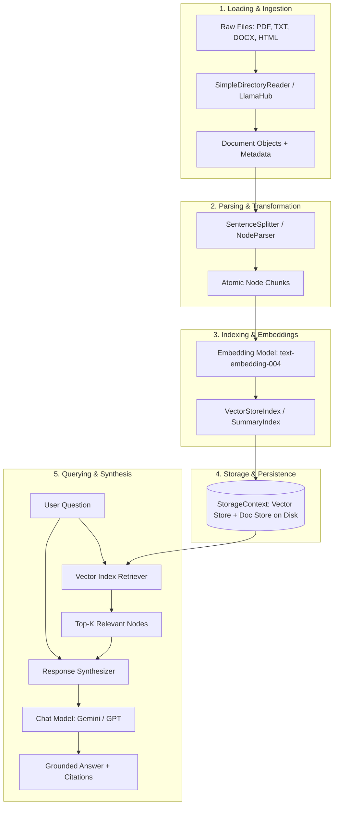
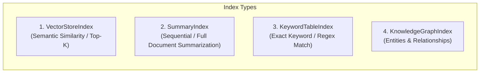
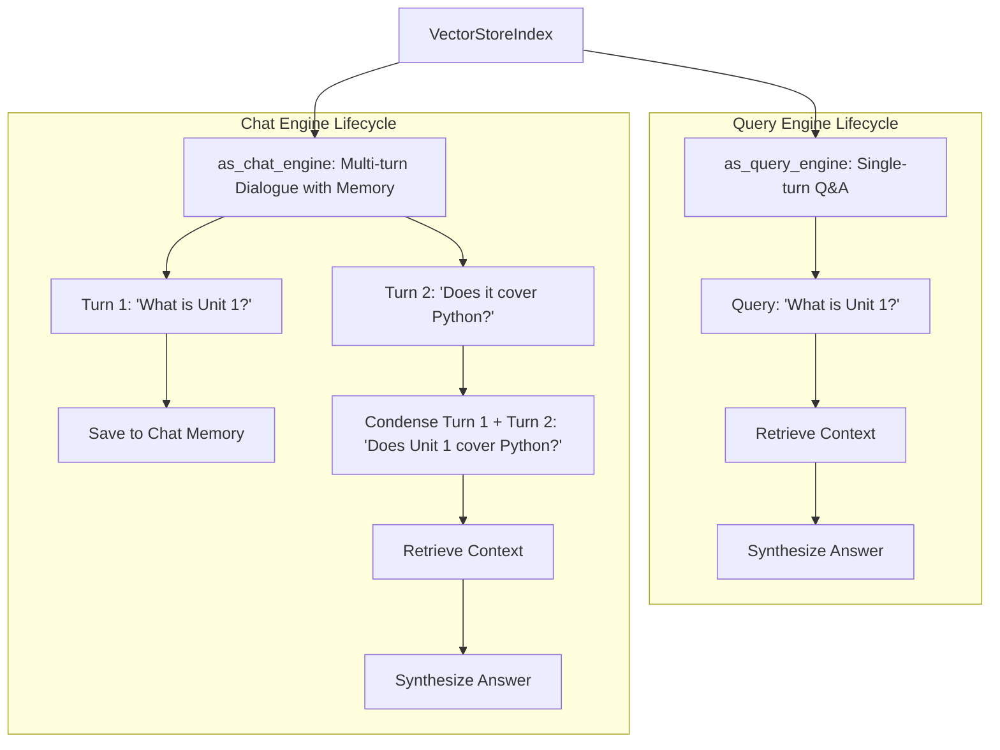

# 3.4 LlamaIndex Framework for Document Search

---

## 1. Introduction: The Need for Data-Centric LLM Architectures

In Units 1 and 2, we learned how to interact with foundation models using raw API requests, configure hyperparameters (such as temperature, top-$p$, and system prompts), and manage token consumption. In Section 3.1, we introduced LangChain as an orchestration framework for chaining model calls, maintaining conversational memory, and enforcing structured Pydantic outputs.

However, modern enterprise applications face a fundamental bottleneck that prompt engineering alone cannot resolve:

### 1.1 The Fundamental Limitations of Foundation Models
1. **Knowledge Cutoff**: Pre-trained foundation models only know facts up to their training cutoff date. They have zero awareness of recent developments.
2. **Lack of Proprietary / Private Data**: Foundation models have never seen your organization's internal documentation, technical manuals, student records, proprietary source code, or legal contracts.
3. **Context Window Constraints**: While modern models boast context windows ranging from 128K to 1M+ tokens, cramming hundreds of megabytes of PDFs into every single prompt is economically prohibitive, introduces severe latency, and degrades model attention (the *"Lost in the Middle"* phenomenon).
4. **Hallucination Risk**: When asked about specialized domain facts outside their training data, models generate plausible-sounding but factually fabricated statements.

### 1.2 Fine-Tuning vs. Retrieval-Augmented Generation (RAG)

To connect an LLM to domain-specific knowledge, two primary architectures exist:

| Criterion | Model Fine-Tuning | Retrieval-Augmented Generation (RAG) |
| :--- | :--- | :--- |
| **Primary Mechanism** | Updates the internal neural network weights ($\mathbf{W}$) via backpropagation. | Keeps model weights frozen; injects external factual context dynamically into the prompt. |
| **Data Freshness** | Static until the next retraining cycle (weeks or months). | Instantaneous; updates as soon as documents in the storage layer change. |
| **Cost & Compute** | High (requires specialized GPU clusters and labeled datasets). | Low to moderate (requires vector embeddings and commodity vector storage). |
| **Source Attribution** | Black box; cannot provide exact page citations or URLs. | Transparent; provides verifiable source citations, page numbers, and chunk references. |
| **Access Control** | Impossible to enforce document-level permissions inside weights. | Straightforward; vector search can filter chunks based on user authorization metadata. |
| **Hallucination Rate** | Moderate to High. | Low (the model is strictly grounded in retrieved reference text). |

### 1.3 Why LlamaIndex?
While LangChain is a **general-purpose orchestration framework** (for agents, general tools, and multi-step computational chains), **LlamaIndex** (formerly *GPT Index*) is a **data-centric framework specifically optimized for Ingestion, Indexing, and Retrieval (RAG)**.

LlamaIndex provides specialized data structures, smart chunking algorithms, document loaders for hundreds of formats via *LlamaHub*, diverse index types (vector, summary, keyword, graph), and advanced retrieval strategies.

---

## 2. The 5 Stages of the LlamaIndex RAG Architecture

LlamaIndex decomposes the retrieval-augmented generation lifecycle into five distinct, decoupled stages:



### Detailed Breakdown of the 5 Stages:
1. **Loading (Ingestion)**: Extracting raw text and associated metadata from raw data formats (PDFs, Markdown, database records, web pages, APIs) into standardized `Document` objects.
2. **Parsing (Transformation)**: Segmenting long documents into smaller semantic units called **Nodes**, ensuring that chunk boundaries preserve sentence cohesion and carry forward essential metadata.
3. **Indexing (Structuring)**: Generating mathematical vector embeddings for each Node and constructing searchable data structures (such as a `VectorStoreIndex`).
4. **Storing (Persistence)**: Saving document indexes, vector embeddings, and metadata to disk or to a production vector database (e.g., Chroma, FAISS, Pinecone, Qdrant) so that re-indexing is not required on subsequent application launches.
5. **Querying (Retrieval & Synthesis)**: Given a user query, computing the query embedding, retrieving the most semantically relevant Nodes via cosine similarity, and passing those Nodes alongside the user prompt to an LLM to synthesize a grounded answer.

---

## 3. Core Abstractions in LlamaIndex

Understanding LlamaIndex requires mastering its fundamental conceptual hierarchy:

```
[ Data Source ]
      │ (Loaded via SimpleDirectoryReader)
      ▼
[ Document ] ── Contains full file text + file-level metadata (filename, size, path)
      │ (Chunked via SentenceSplitter / NodeParser)
      ▼
   [ Node ]   ── Contains atomic text chunk + chunk metadata + relationships (parent, prev, next)
      │ (Embedded via Embedding Model)
      ▼
   [ Index ]  ── Structured collection of Nodes (VectorStoreIndex, SummaryIndex, etc.)
      │ (.as_query_engine())
      ▼
[ QueryEngine ] ── Combines Retriever + ResponseSynthesizer into a single queryable object
```

### 3.1 The `Document` Abstraction
A `Document` is a container that wraps any data source. It holds:
* `text`: The raw text content of the document.
* `metadata`: A dictionary of key-value attributes (e.g., `{"file_name": "syllabus.txt", "author": "Hasmukh Mer", "date": "2026-09-28"}`).
* `excluded_embed_metadata_keys`: Metadata keys that should *not* be converted into vector embeddings (e.g., file paths or private IDs).
* `excluded_llm_metadata_keys`: Metadata keys that should *not* be shown to the LLM during answer synthesis.

### 3.2 The `Node` Abstraction (The Atomic Unit of LlamaIndex)
A `Node` is the fundamental atomic chunk of data in LlamaIndex. While a `Document` represents an entire book or PDF, a `Node` represents a specific paragraph or text segment (e.g., 512 tokens).

Crucially, **Nodes retain relationships**:
* `NodeRelationship.SOURCE`: Reference back to the parent `Document`.
* `NodeRelationship.PREVIOUS`: Reference to the preceding chunk in the original document.
* `NodeRelationship.NEXT`: Reference to the succeeding chunk in the original document.

This relational awareness allows LlamaIndex to perform advanced retrieval techniques, such as expanding a retrieved chunk to include surrounding context sentences before feeding it to the LLM.

### 3.3 Node Parsers & Text Splitters
Text splitters govern how `Document` objects are partitioned into `Node` objects.

```python
from llama_index.core.node_parser import SentenceSplitter

# Create a splitter that respects sentence boundaries
splitter = SentenceSplitter(
    chunk_size=512,       # Maximum number of tokens per node
    chunk_overlap=50      # Number of overlapping tokens between consecutive nodes
)

# Generate nodes from documents
nodes = splitter.get_nodes_from_documents(documents)
```

#### Why Chunk Overlap Matters:
Consider a critical sentence split exactly across a chunk boundary:
* *Without overlap*: Chunk A ends with *"The final exam will cover Units 1 and 2,"* and Chunk B begins with *"while Unit 3 will be evaluated via practical assignments."* A query about *"How is Unit 3 evaluated?"* might fail to match Chunk A and lack the full context in Chunk B.
* *With overlap ($50$ tokens)*: The transitional sentence is preserved in both chunks, preventing semantic discontinuity.

$$\text{Chunk Overlap Ratio} = \frac{\text{Overlap Tokens}}{\text{Chunk Size Tokens}} \approx 10\% - 15\%$$

---

## 4. Modern Configuration: `Settings` vs. Legacy `ServiceContext`

> [!IMPORTANT]
> **LlamaIndex v0.10+ Architectural Shift**: Older tutorials and legacy codebases frequently use `ServiceContext.from_defaults()`. In modern LlamaIndex (v0.10.0 and above), `ServiceContext` is deprecated and replaced by the unified global **`Settings`** singleton object.

### Modern Global `Settings` Configuration:
```python
from llama_index.core import Settings
from llama_index.llms.gemini import Gemini
from llama_index.embeddings.gemini import GeminiEmbedding

# 1. Configure Global LLM (Generation Engine)
Settings.llm = Gemini(model="models/gemini-1.5-flash", api_key="YOUR_API_KEY")

# 2. Configure Global Embedding Model (Vector Engine)
Settings.embed_model = GeminiEmbedding(model_name="models/text-embedding-004", api_key="YOUR_API_KEY")

# 3. Configure Global Chunking Parameters
Settings.chunk_size = 512
Settings.chunk_overlap = 50
```

Once configured, any index, retriever, or query engine instantiated downstream automatically inherits these global configurations without manual parameter passing.

---

## 5. Index Types in LlamaIndex

LlamaIndex offers multiple index structures tailored for different retrieval patterns:



### 5.1 `VectorStoreIndex` (Most Common)
Stores mathematical embeddings for every node. At query time, it computes the query's vector embedding, performs cosine similarity calculations across the entire index, and retrieves the top-$k$ closest nodes.
* **Best For**: Specific question answering, semantic search, finding facts across large document corpuses.
* **Complexity**: $O(N)$ for brute-force cosine similarity, or $O(\log N)$ using Approximate Nearest Neighbor (ANN) index structures (such as HNSW).

### 5.2 `SummaryIndex` (formerly `ListIndex`)
Stores nodes sequentially as a simple flat list. During querying, it retrieves *all* nodes or iterates through them with a refining prompt.
* **Best For**: "Summarize this entire textbook," or "What are the main themes across all uploaded files?"
* **Drawback**: Consumes high token counts since all nodes are processed.

### 5.3 `KeywordTableIndex`
Extracts keywords from each node and builds an inverted keyword lookup table (mapping `keyword -> [node_ids]`).
* **Best For**: Queries with explicit technical codes, model numbers, IDs, or exact medical/legal terminology where semantic embeddings might approximate instead of matching exact strings.

---

## 6. Storage & Persistence (`StorageContext`)

Building vector embeddings requires API calls to embedding models (which cost tokens and time). Re-embedding an entire corporate library every time a server restarts is unfeasible.

LlamaIndex provides `StorageContext` to persist indices to the local filesystem or a vector database:

```python
from llama_index.core import (
    VectorStoreIndex,
    SimpleDirectoryReader,
    StorageContext,
    load_index_from_storage
)
import os

PERSIST_DIR = "./storage"

if not os.path.exists(PERSIST_DIR):
    # 1. First run: Load docs, build index, and persist to disk
    documents = SimpleDirectoryReader("data").load_data()
    index = VectorStoreIndex.from_documents(documents)
    index.storage_context.persist(persist_dir=PERSIST_DIR)
    print("✅ Index created and saved to disk.")
else:
    # 2. Subsequent runs: Instant reload from disk (Zero API embedding cost!)
    storage_context = StorageContext.from_defaults(persist_dir=PERSIST_DIR)
    index = load_index_from_storage(storage_context)
    print("⚡ Index reloaded instantly from disk.")
```

### Files Created Inside `./storage`:
* `docstore.json`: Serialized document and node contents with metadata.
* `index_store.json`: The structural metadata of the index.
* `vector_store.json`: The raw float vectors (embeddings) for all nodes.
* `image_embed_store.json`: For multimodal indices.

---

## 7. Query Engines vs. Chat Engines

LlamaIndex provides two distinct interfaces for interacting with an index:



### 7.1 Query Engine (Stateless Q&A)
Optimized for one-off factual lookups:
```python
query_engine = index.as_query_engine(similarity_top_k=2)
response = query_engine.query("What topics are covered in Unit 3?")
print("Answer:", response)

# Inspecting Source Attributions (Citations)
for node in response.source_nodes:
    print(f"Source: {node.metadata.get('file_name')} | Score: {node.score:.4f}")
    print(f"Content: {node.text[:120]}...\n")
```

### 7.2 Chat Engine (Stateful Conversational RAG)
Maintains conversation memory across multiple conversational turns:
```python
chat_engine = index.as_chat_engine(
    chat_mode="condense_question",  # Reformulates follow-up queries using history
    verbose=True
)

res1 = chat_engine.chat("What does Unit 3 cover?")
res2 = chat_engine.chat("Who is teaching it?")  # Under the hood: 'Who is teaching Unit 3?'
```

#### Supported Chat Modes:
1. **`condense_question`**: Uses the LLM to rewrite the user's latest follow-up question into a standalone standalone query incorporating context from chat history before vector search.
2. **`context`**: Retrieves relevant nodes for each turn and injects conversation history directly into the system prompt.
3. **`react`**: Treats the index as a tool inside a ReAct (Reasoning + Acting) autonomous agent loop.

---

## 8. Response Synthesis Modes

When retrieved nodes are handed to the LLM, the **Response Synthesizer** decides how context chunks are merged into prompt tokens:

| Mode | Strategy | Use Case | Token Efficiency |
| :--- | :--- | :--- | :--- |
| **`compact`** *(Default)* | Concatenates as many text chunks as possible into a single LLM prompt window up to the token limit. | General Q&A; fast and cost-effective. | High (minimizes LLM API calls). |
| **`refine`** | Evaluates the first chunk to generate an initial draft, then sequentially sends subsequent chunks to *refine* the answer. | Comprehensive document analysis where no detail can be omitted. | Low (requires 1 LLM call per chunk). |
| **`tree_summarize`** | Hierarchically summarizes chunks in a bottom-up tree structure until a single synthesis remains. | Very long multi-document summarization. | Moderate. |
| **`accumulate`** | Executes the prompt independently across each chunk and returns an array of answers. | Survey queries ("Extract all email addresses from each document"). | Low (parallel independent calls). |

```python
query_engine = index.as_query_engine(
    response_mode="compact",
    similarity_top_k=3
)
```

---

## 9. Comprehensive Comparison: LangChain vs. LlamaIndex

A frequent question in enterprise AI architecture is: *"Should we use LangChain or LlamaIndex?"*

| Dimension | LangChain | LlamaIndex |
| :--- | :--- | :--- |
| **Core Philosophy** | General-purpose orchestration: chains, agents, multi-tool workflows, cognitive loops. | Data-first framework: specialized ingestion, advanced parsing, indexing, and retrieval. |
| **Primary Abstraction** | `Runnable`, `PromptTemplate`, `Chain`, `AgentExecutor`. | `Document`, `Node`, `Index`, `QueryEngine`, `ChatEngine`. |
| **Chunking & Nodes** | Basic character/recursive text splitters returning `Document` objects. | Hierarchical `Node` abstractions preserving document relationships (`parent`, `prev`, `next`). |
| **Connectors** | Community document loaders (`langchain-community`). | Comprehensive *LlamaHub* (over 300+ data loaders for Notion, Slack, Jira, SQL, S3). |
| **Retrieval Strategies** | Standard vector retriever, parent-document retriever. | Advanced node postprocessors, auto-merging retrievers, sentence-window retrievers, hierarchical search. |
| **Best Used When** | Building generalist AI assistants, multi-step agent workflows, code generation agents. | Building search engines over documents, deep document Q&A, enterprise RAG, knowledge graphs. |
| **Working Together** | **Synergy**: Convert a LlamaIndex query engine into a LangChain Tool (`LlamaIndexTool.from_query_engine(engine)`)! |

---

## 10. Summary & Best Practices Checklist

When deploying a document search pipeline with LlamaIndex:
1. ✅ **Always Persist Indexes**: Never re-embed documents on every application boot; use `index.storage_context.persist()`.
2. ✅ **Tune Chunk Size & Overlap**: Default to `chunk_size=512` and `chunk_overlap=50` for general prose. For dense technical or legal documentation, consider smaller chunks (`256`) with sentence-window retrieval.
3. ✅ **Inspect Source Attributions**: Always surface `response.source_nodes` and `node.score` in your user interface to provide citation transparency and verify grounding.
4. ✅ **Use Modern Settings**: Avoid legacy `ServiceContext`; configure `Settings.llm` and `Settings.embed_model` globally.
5. ✅ **Exclude Irrelevant Metadata from Embeddings**: Use `excluded_embed_metadata_keys` to keep URLs, internal IDs, and timestamps from polluting semantic vector space.

---

## 11. Review & Self-Assessment Questions

### Q1: What is the key structural difference between a `Document` and a `Node` in LlamaIndex?
* **Answer**: A `Document` represents an entire external data source (e.g., a 50-page PDF or a complete database record) containing raw text and global metadata. A `Node` is an atomic semantic chunk (e.g., 512 tokens) derived from a `Document`. Unlike generic text chunks, a `Node` maintains explicit relational pointers to its source document, previous sibling node, and subsequent sibling node.

### Q2: Why is the global `Settings` object used instead of `ServiceContext` in modern LlamaIndex?
* **Answer**: `ServiceContext` was a monolithic bundle that had to be passed explicitly across indices, retrievers, and query engines. Starting in LlamaIndex v0.10.0, the framework transitioned to `Settings`, a global singleton that configures the default LLM, embedding model, node parser, and prompt templates across the entire application without boilerplate parameter propagation.

### Q3: How does the `compact` response synthesis mode differ from the `refine` mode?
* **Answer**: In `compact` mode, LlamaIndex concatenates as many retrieved text chunks as will fit into the model's context window and issues a single LLM API call. In `refine` mode, LlamaIndex evaluates the first chunk to formulate an initial answer, and then sequentially makes separate LLM calls for each remaining chunk to iteratively refine and expand the answer. `compact` is faster and more cost-effective, while `refine` is more exhaustive.

### Q4: Explain the purpose of `StorageContext.persist()` and how it improves application performance.
* **Answer**: Generating vector embeddings requires time and API credits. `storage_context.persist(persist_dir)` saves the document store, index structure, and vector embeddings to JSON files on disk. On subsequent startups, `load_index_from_storage()` loads the index instantly without needing to re-read raw files or re-compute vector embeddings.

### Q5: How does a `ChatEngine` in `condense_question` mode handle ambiguous follow-up questions like "Does it cover Python?"
* **Answer**: It takes the prior conversational history (e.g., *Turn 1: "Tell me about Unit 1"*) and the ambiguous follow-up question (*Turn 2: "Does it cover Python?"*), passes them to an internal LLM prompt, and synthesizes a standalone search query: *"Does Unit 1 of the curriculum cover Python?"*. This standalone query is then used for vector search, ensuring relevant chunks are retrieved even when the user uses pronouns or implicit references.
